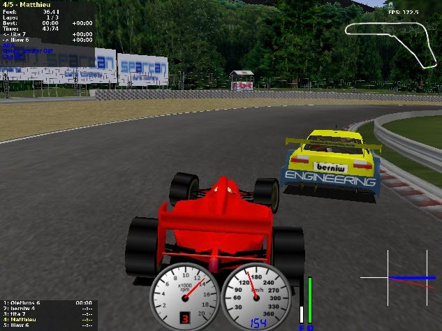

% Continuous Control with Deep Deterministic Policy Gradients
% John Berroa, Felix Meyer zu Driehausen, Alexander Höreth
% University of Osnabrück

# Introduction
With the *Deep Deterministic Policy Gradient*, or DDPG, we want to be able to train an artifical agent through reinforcement learning how to act in an environment in which the actions are on a continuous scale.  Some examples applications of this would be car racing (e.g. steering, gas pressure, brake pressure) and games (e.g. Lander).  Continuous control reinforcement learning brings reinforcement learning out of the realm of toy applications and the theoretical and brings it into the continuous world of reality.  To do this, however, requires a more complex approach than normal reinforcement learning.  Below we will outline the idea behind DDPG.

## Q-Learning
Reinforcement learning allows an artifical agent to learn a task without being provided with labels, but instead reward which hints at the proper action to take.  Put very simply, the agent wants to repeat the actions that give highest reward.  The classic reinforcement learning approach, *Q-Learning*, creates a table of State-Action value pairs over many iterations of the agent running through the task, called *episodes*.  This table is then used to pick actions: when in a particular state, the actor picks the action that has the highest "Q-value," which if the agent has learned the task properly, will be the most optimal action to take given that state.  Q-learning can be abstracted into an artificial neural network to create a neural representation of this Q-table.  This is called *Deep Q Network*, or DQN.  DQN has been used in a variety of applications, most notably Atari games.

## Continuous Actions
However, the downfall of DQN and Q-learning is that actions are discrete.  Imagine trying to drive a car, and the goal in a particular state is to avoid a crash.  The wheel must be turned $50^\circ$ (or more) to avoid the obstacle.  A discrete action space such as **Left/Right** might not be enough of a turn to survive.  Discretizing the wheel into $5^\circ$ increments might work, but leads to a combinatorial explosion, as well as not allowing all the degrees of turn in between.  This problem compounds and ultimately leads to the realization that Q-learning is insufficient for continuous actions because of the table representation.  The table would need to be infinitely long in the *Action* axis, and to take the $\textrm{max}$ of an infinite series of numbers is impossible.  On the bright side, continuous actions gives us a policy gradient, and when there's a gradient, there's the ability to optimize.  In this case, maximization is what we want because we want to maximize our future reward.  If we maximize this policy gradient, we will be able to learn continuous actions in reinforcement learning.

The following sections will be laid out as follows: first, we will describe in detail the theoretical basis of DDPG; second, we will discuss how to train DDPG in code with the racing game TORCS, and also how to get the TORCS environment installed; lastly, we will conclude the paper with some comments.

{width=50%}

# Theoretical Basis
Policy gradient methods are an estabished branch of reinforcement learning techniques that try to optimize a parameterized policy with respect to its long term cumulative reward. Foundational work for the deep determinictic policy algorithm that we are presenting here was laid over the last decades. In the following, we will very briefly present how  policy gradient methods evolved towards DDPG. Therefore we refer to @Sutton2000 for policy gradients in general, @Silver2014 for the deterministic policy gradient, and finally @Lillicrap2015 for deep deterministic policy gradients. 

## Policy Gradient
The core of every policy gradient method is to optimize the policy, through changing its parameters. In order to optimize, one needs a measurement of the performance of a particular policy. In an episodic environment with a clearly defined start state, the goodness of the policy is the cumulative reward gained when coming from the start state. The performance objective can be written as
$$ J_1(\theta)  = \mathbb{E_\pi}(R_{t+1}+\gamma R_{t+2}+\gamma^2R_{t+3}+...|S_t) $$ 
where $\theta$ is the set of parameters of the policy $\pi$. In words, the performance objective is the expected, and by $\gamma$ discounted reward over a trajectory of future states. Taking this into account, our goal can be more clearly defined as finding the gradient of the performance objective with respect to $\theta$. This gradient would allow us to change $\theta$ in order to maximize the performance objective.

A whole trajcetory of states is a sequence of states $s$, actions $a$ and rewards $r$, for example: $\tau = (s_0 , a_0 , r_0 , s_1 , a_1 , r_1 , ... , s_{T-1} , a_{T-1} , r_{T-1} , s_T )$ Then, the gradient with respect to parameters $\theta$ of the expected return of trajectory $\tau$ can be expressed as
$$ \nabla_{\theta} \mathbb{E}_{\tau} [R(\tau)] = \mathbb{E}_{\tau} [\nabla_{\theta} \log \, p(\tau | \theta) R(\tau)] $$ 
This expression follows directly from the performance objective (score function) and the definiton of expectation.  We refer to a nice illustration of this relation in a blog post by Andrej Karpathy[^karpathy] for a stepwise explanation.

[^karpathy]: [http://karpathy.github.io/2016/05/31/rl/](http://karpathy.github.io/2016/05/31/rl/) 

Under the markov assumption we can detail $p(\tau | \theta)$ into a product of terms corresponding to a timestep within the trajectory each:
$$ p(\tau | \theta) = \prod_{t=0}^{T-1} \left[ \pi(a_t | s_t , \theta) P(s_{t+1} , r_t | s_t , a_t) \right] $$
Here, $\pi(a_t | s_t , \theta)$ is the (stochastic) policy, giving a distribution over actions depending on the current state $s_t$ and the parameter set $\theta$. $P(s_{t+1} , r_t | s_t , a_t)$ is the state transition probability distribution, which is detailing probabilities for each state-state transition pair. 

As we are aiming to estimate $\nabla_{\theta} \log \, p(\tau | \theta)$, taking $\log \, p(\tau | \theta)$ transforms the product into a sum. Further, the gradient $\nabla_{\theta}$ is not dependent on $P(s_{t+1} , r_t | s_t , a_t)$. Therefore the policy gradient simplifies to 
$$ \nabla_{\theta} \mathbb{E}_{\tau}[R] = \mathbb{E}_{\tau}[ R \nabla_{\theta}  \sum_{t=0}^{T-1} [\log \, \pi(a_t | s_t , \theta)] ]$$

 When using the state-action value function $Q^{\pi}$ for $R$ the policy gradient is: 
$$ \nabla_{\theta} \mathbb{E}_{\tau}[R] = \mathbb{E}_{\tau} [ \sum_{t=0}^{T-1} \nabla_{\theta} \log \, \pi(a_t | s_t , \theta) Q^{\pi}(s_t,a_t) ]$$

@Sutton2000

So far we have introduced the stochastic policy gradient. The deterministic policy gradient was proven to exist more recently by @Silver2014. As mentioned above, the deterministic policy gradient is essential for solving continuous control problems. The deterministic policy gradient is mathematically a special case of the stochastic policy gradient and, in first impression, also looks quite different. A thourough derivation can be found in @Silver2014, which builds upon the beforementioned ideas behind the stochastic policy gradient. Further, we provide some more information on how to apply the deterministic policy gradient in our notebook on Lunar Lander.[^lander]

## Deep Deterministic Policy Gradient
The deep deterministic policy gradient, as introduced by @Lillicrap2015, addresses the problem of estimating $Q^{\pi}$ by using deep neural networks. As these estimators on their own simply fulfill a role in the reinforcement learning framework, we describe them in the more application oriented notebook for Lunar Lander [^lander].

# Implementation

## Tutorial
Because of the complexity of the employed neural network (which is basically four networks), we provide an extensively documented and interactive tutorial. The tutorial guides the user through a complete implementation of the DDPG algorithm applied to the Lunar Lander (see figure ##) environment from the OpenAI Gym [@Brockman2016].[^lander]

Additionally, targeted for those new to reinforcement learning in general, we provide a notebook all around tabular Q-learning solving the classical Frozen Lake game. In frozen lake one has to control an agent over a small map from start to goal. The challenge is, that the environment is non deterministic: At each step there is a 33% chance of slipping and moving orthogonally to the originally executed action.

The notebook implements three algorithms: Q-Learning as taught in the Institute of Cognitive Science's Machine Learning lecture on the deterministic game (meaning there is no slippery ice because the algorithm is unable to solve it otherwise), Q-Learning itself and the classical, non-greedy SARSA algorithm.

The difference between Q-Learning and SARSA in short is that Q-Learning greedily chooses the maximum future Q value for the Bellman equation approximation while SARSA (which fittingly is an abbreviation for *S*tate, *A*ction, *R*eward, *S*tate, *A*ction) uses the current policy for that estimation. For more details, see the notebook.[^lake]

[^lander]: [github.com/ahoereth/ddpg $\rightarrow$ exploration/Lander.ipynb](https://github.com/ahoereth/ddpg/blob/master/exploration/Lander.ipynb)
[^lake]: [github.com/ahoereth/ddpg $\rightarrow$ exploration/FrozenLake.ipynb](https://github.com/ahoereth/ddpg/blob/master/exploration/FrozenLake.ipynb)

## DDPG
- based on a hand full of classes which interact with one another
  - agent & environment & memory, each pair a thread
  - multimemory, enabling sampling from many memories
  - dataflow, using queues for feeding the data to the tensorflow graph
  - trainer, threaded training of a model
  - model, abstract class for implementing reinforcement learning algorithms on gym-like tasks
  - DDPG & DQN (todo), inheriting from the model class and implementing an algorithm each
- only the DDPG class needs to be instantiated with all its hyperparameter settings and the name of an environment, everything else is abstracted

{width=50%}

## Torcs
- really old game, hard to get up and running
- abstracted away into a docker container so we can run it remotely

{width=50%}

# Training the Deep Deterministic Policy Gradient Algorithm

## The Network

## Obtaining TORCS

# Conclusion
As mentioned in the introduction, continuous action reinforcement learning allows us to do so much more in the real world with the theories behind learning from reward.  The DDPG paper was huge when it came out, and most reinforcement learning papers these days reference it or some derviative work in some way.

## References {.allowframebreaks}

\footnotesize

