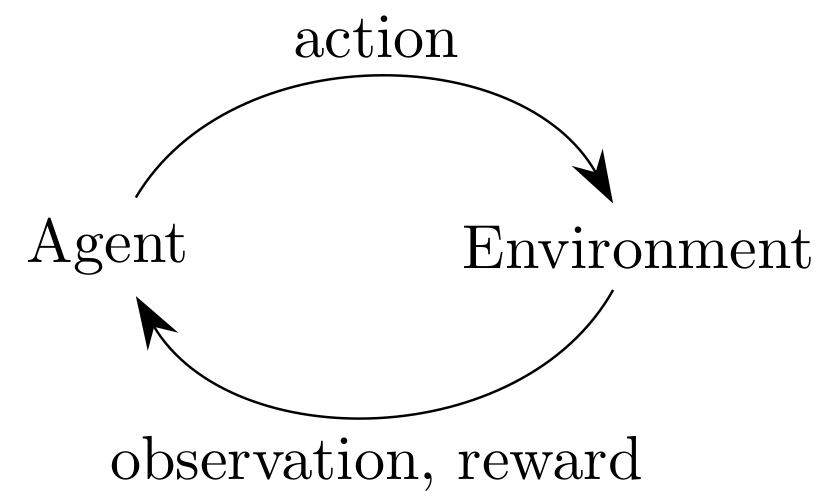
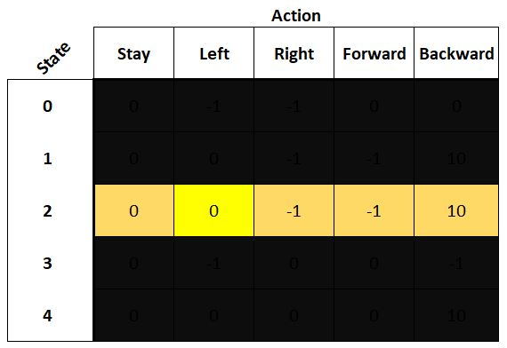
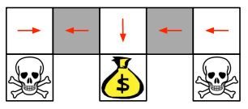

# Reinforcement Learning Recap

## Problem setting

{ width=35% }

- An agent is within an environment
- The agent is to complete some task and receive reward
- It solves this task over some amount of time steps

@Silverslides

## Markov Decision Processes

The environment in RL can be described as a Markov Decision Process

This relies on what's called a Markov State:
$$\mathbb{P}[S_{t+1}|S_t]=\mathbb{P}[S_{t+1}|S_1...S_t]$$
This means:

- The future is independent of the past, given the present
- The state is a sufficient statistic of the future
- All previous states can be thrown away and the same result will still be calculated

Note: For the Markov property to hold, the environment must be fully observable.

## MDP: Observability

- In a *fully observable environment*, the agent's internal state is the same as the environment's internal state
    - i.e., the agent knows how the environment works exactly, and can therefore predict what each of its action will do with 100% accuracy
    - Put formally, the observation at time $t$ is the same as both the agent's and environment's internal representations $O_t=S^a_t=S^e_t$
    - Can be represented with an MDP
- In a *partially observable environment*, the agent only indirectly observes the environment's state
    - The agent must construct it's own internal state based on its belief/construction of the environment state
    - Can be represented with a *Partially Observable Markov Decision Process*, POMDP

<!--
## MDP: From Chains to Reward Processes

*Chain*: A *Markov Process* or *Chain* is a random sequence of states with the Markov property, defined by tuple:
$$\left \langle S,P \right \rangle$$

where $S$ is the (finite) state space and $P$ is the state transition matrix (matrix of state transition probabilities)

## MDP: From Chains to Reward Processes

*Markov Reward Process*: Add in reward values to a Markov chain.  Our tuple becomes:
$$\left \langle S,P,R,\gamma \right \rangle$$

where $R$ is a reward function and $\gamma$ is a discount factor, $\gamma \in [0,1]$

Now that we have reward, we can calculate the total reward of a sequence/chain:
$$G_t=R_{t+1}+\gamma R_{t+2}+...=\sum_{k=0}\gamma^k R_{t+k+1}$$

## MDP: Value Functions

The *State-Value Function* gives the long term value of state $s$, i.e. the expected reward if the agent starts in this state
$$V(s)=\mathbb{E}(G_t|S_t=s)$$

We have to take the expectation because $G_t$ is random; we need to know the expected value based on all random permutations of traversals through the Markov process

-->
## MDP: Now to the Markov Decision Process

*"Decision"* in *Markov* ***Decision*** *Process* means that actions need to be chosen--therefore, we add a policy to choose actions

An MDP can be represented as a tuple::
$$\left \langle S,A,P,R,\gamma \right \rangle$$
where:

$S$ is the (finite) state space

$A$ is a finite set of actions

$P$ is the state transition matrix (matrix of state transition probabilities)

$R$ is a reward function

$\gamma$ is a discount factor, $\gamma \in [0,1]$

## MDP: Value Functions

The *State-Value Function* depends on the policy, and determines how good it is to be in a given state:
$$V^\pi(s)=\mathbb{E_\pi}(G_t|S_t)$$

*"The expectation when we sample all actions according to this policy $\pi$"; the value of a state*

The *Action-Value Function* is defined as how good it is to take a particular action when the agent is in a particular state:
$$Q^\pi(s,a)=\mathbb{E_\pi}(G_t|S_t=s, A_t=a)$$

*"The expected return starting from state $s$, taking action $a$, and then following policy $\pi$"; the value of an action*

## MDP: Solving Reinforcement Learning

We want to maximize the value of our actions based on future reward, therefore (* denotes max/optimal function): FIXTHISFIXTHISFIXTHISFIXTHISFIXTHISFIXTHIS
$$V^*(s)=\max_a Q^*(s,a)$$
$$Q^*(s,a)=R_s^a+\gamma \sum_{s'\in S} P_{ss'}^a V^*(s')$$

We can nest these to get:
$$Q^*(s,a)=R_s^a+\gamma \sum_{s'\in S} P_{ss'}^a \max_a Q^*(s,a)$$

This is the *Bellman Optimality Equation* (note: it can be nested in the other direction too to solve for $V_*(s)$)

Solve this, and the reinforcement learning problem is solved.

## Q-Learning

Method to solve $Q^*$

- Iteratively act through *episodes*
- Backpropagate reward in order to calculate Q values which tell the values of actions
- Take the maximum Q value at each time step
- Store Q values into a table
$$Q(s_t,a_t)=Q(s_t,a_t) + \alpha_t \cdot (R_{t+1}+\gamma \max_a Q(s_{t+1},a) - Q(s_t,a_t))$$

## Q-Learning

### DQN

- Uses a neural network to learn $Q^*$
- Can be thought of as looking at a state row in the Q-table, then taking the argmax

### Continuous Actions

- Discretizing the action space almost always leads to combinatorial explosion:
    - Consider discretizing the human arm (7-DoF) into Up/Straight/Down--$3^7=2187$ dimensional action space
- If we can't (or don't want to) discretize the action space, the Q-table becomes incalculable (would equate to an infinite length table)
- Therefore, Q-learning (and by extension DQN) will not work when dealing with continuous actions

## Q-Learning

## Q-Learning -- Deterministic Policies

\columnsbegin
\column{.5\textwidth}

- A deterministic policy can lead an agent into an infinite loop
- Imagine this rule from some policy:
    - "Whenever there is a wall to the north and south, go left"
- If we applied this policy to the problem pictured, the agent would get stuck
- This can be solved by using a stochastic policy and leaving $\gamma$ active during test time

\column{.50\textwidth}

\columnsend

## Some Helpful Definitions

To follow everything to come, it is necessary to have a general grasp of the following concepts:

- **Agent**: what performs actions in the environment; wants to maximize future reward
- **Environment**: where the agent resides and what gives observations and reward; interacted with by agent
- **Reward**: $R_t$; reward at time step $t$, scalar
- **Observation**: $O_t$; what the environment shows the agent at step $t$, after an action
- **Action**: $A_t$; the action taken at step $t$, performed by agent
- **History**: sequence of observations, actions, and rewards up to current time step; i.e. $H_t=A_1,O_1,R_1...A_t,O_t,R_t$
- **State**: a function of history; $S_t=f(H_t)$; the information used to determine what happens next

## Some Helpful Definitions

- ***Fully observable***: the environment state equals the agent state; $S_t^a=S_t^e$; the agent knows the complete dynamics of the environment; MDP
- ***Partially observable***: the agent must make an assumption about the environment because it doesn't know it's dynamics
- **Model**: the agent's internal representation of the environment
- **Policy**: $\pi$; what the agent uses to map states to actions; tells the agent what to do
- ***Deterministic policy***: a state will always lead to a certain action; $a=\pi(s)$
- ***Stochastic policy***: a state will yield a probability of actions to choose from; $\pi(a|s)=\mathbb{P}(A=a|S=s)$
- ***State-Value Function***: tells the value of a state based on the expected future reward
- ***Action-Value Function***: tells the value of an action based on expected future reward

## Types of Reinforcement Algorithms

- Value Based (e.g. Q-Learning)
    - No policy (implicit)
    - Value function
- Policy Based
    - Policy
    - No value function
- ***Actor-Critic***
    - Policy
    - Value function
- Model Based/Model Free
    - Policy and/or Value function
    - Based: has model; Free; no model
