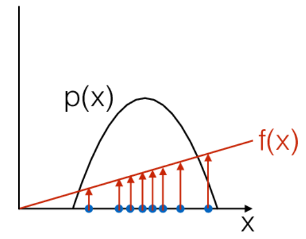

# Policy Gradients

## Policy Objective Function

- Plan: Given policy $\pi_{\theta}(s,a)$ with parameters $\theta$, find the best $\theta$
- How can we measure the goodness of a policy?
- We consider episodic environments with a start state
- The goodness of policy is the return gained when coming from the start state
- This is denoted by the performance objective: 
$$ J_1(\theta)  = V^{\pi_{\theta}}(s_1) = \mathbb{E}[r_1^{\gamma}| s_1; \pi_{\theta}] $$ 

We will find the gradient of the performance objective with respect to $\theta$. This allows us to change $\theta$ in order to maximize the performance objective.

## Adjusting with respect to a score function

{ width=30% }

- sampling $x$ from $p(x)$
- evaluating $f(x)$

## Adjusting with respect to a performance gradient 

{ width=30% }

- manipulate $p(x)$ according to magnitude of $f(x)$
- re-normalize $p(x)$

Goal: Change p(x) such that it "produces" x which in turn result in high values in the score function. **But how to change $p(x)$**?

## Score Function Gradient Estimator
 
\begin{align}
\nabla_{\theta} E_x[f(x)] &= \nabla_{\theta} \sum_x p(x | \theta) f(x) & \text{definition of expectation} \\
& = \sum_x \nabla_{\theta} p(x | \theta) f(x) & \text{swap sum and gradient} \\
& = \sum_x p(x | \theta) \frac{\nabla_{\theta} p(x | \theta)}{p(x | \theta)} f(x) & \text{both multiply and divide by } p(x | \theta) \\
& = \sum_x p(x | \theta) \nabla_{\theta} \log p(x | \theta) f(x) & \text{use the fact that } \nabla_{\theta} \log(z) = \frac{1}{z} \nabla_{\theta} z \\
& = E_x[f(x) \nabla_{\theta} \log p(x | \theta) ] & \text{definition of expectation}
\end{align}

Now we need to sample $x_i \sim\ p(x | \theta)$, and compute $$\hat{g}_i = f(x_i)\nabla_{\theta} \log(p(x_i | \theta))$$

## Score function gradient estimator intuition

$$\hat{g}_i = f(x_i)\nabla_{\theta} \log p(x_i | \theta)$$

- $f(x)$ measures how good the sample $x$ is (score function)
- Stepping (ascending) in the direction $\hat{g}_i$ increments the $\log$ probability of the $x$, proportionally to the score
- x which yield good scores in f become more probable

## Score function Gradients in context of policies
In the context of policies the random variable x is a whole trajectory $\tau = (s_0 , a_0 , r_0 , s_1 , a_1 , r_1 , ... , s_{T-1} , a_{T-1} , r_{T-1} , s_T )$

Previous slide:
$$\hat{g}_i = f(x_i)\nabla_{\theta} \log p(x_i | \theta) $$ 

Now in the context of policies:
$$ \nabla_{\theta} E_{\tau} [R(\tau)] = E_{\tau} [\nabla_{\theta} \log \, p(\tau | \theta) R(\tau)] $$ 

Now we detail $p(\tau | \theta)$:

$$ p(\tau | \theta) = \mu(s_0) \prod_{t=0}^{T-1} [\pi(a_t | s_t , \theta) P(s_{t+1} , r_t | s_t , a_t)] $$

## Score function Gradients in context of policies II

$$ \log \, p(\tau | \theta) = \log \, \mu(s_0) + \sum_{t=0}^{T-1} [\log \, \pi(a_t | s_t , \theta) + \log \, P(s_{t+1} , r_t | s_t , a_t)] $$

Now differentiating with respect to $\theta$

$$ \nabla_{\theta} \log \, p(\tau | \theta) = \nabla_{\theta}  \sum_{t=0}^{T-1} [\log \, \pi(a_t | s_t , \theta) $$

The gradient is not dependent on the state transition distribution $P(s_{t+1} , r_t | s_t , a_t)$. Inserting back into the expectation yields:

$$ \nabla_{\theta} \mathbb{E}_{\tau}[R] = \mathbb{E}_{\tau}[ R \nabla_{\theta}  \sum_{t=0}^{T-1} [\log \, \pi(a_t | s_t , \theta)] ]$$

## Stochastic policy gradient theorem

- When using the state-action value function $Q^{\pi}$ for $R$ the policy gradient is: 
$$ \nabla_{\theta} \mathbb{E}_{\tau}[R] = \mathbb{E}_{\tau} [ \sum_{t=0}^{T-1} \nabla_{\theta} \log \, \pi(a_t | s_t , \theta) Q^{\pi}(s_t,a_t) ]$$

## Stochastic Actor - Critic

Actor - Critic is an architecture based on the policy gradient theorem.

- *actor* adjusts the parameters $\theta$ of the policy $\pi$
- this is done by stochastic ascent of the policy gradient 

- The real $Q^{\pi}(s,a)$ is unknown
- Therefore function $Q^{w}(s,a)$ with parameters $w$ is approximated (e.g with deep neural network)
- A *critic* estimates parameters the action-value function $Q^{w}$

