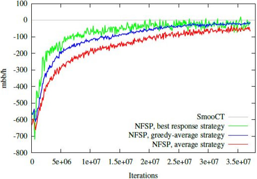
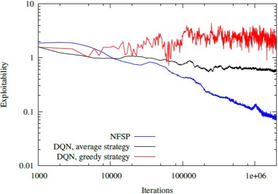
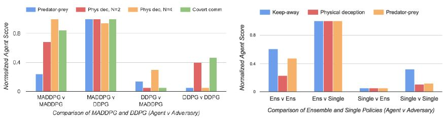

# Applications of Reinforcement Learning

## Overview

We will discuss:
  - Robotics and Reinforcement Learning
    - Toddler
    - Safety Frameworks
  - Cutting Edge Applications of Reinforcement Learning
    - Poker
    - Multiple Agents

@Tedrake2005
@Fisac2017
@Li2017
@Heinrich2016
@Lowe2017

## Robotics and Reinforcement Learning

### The General Problem of Robotics

- The world is full of noise
  - Great for neural networks!
- Simulations can't simulate the full range and accuracy of the real world, so training actual robots is best
- Danger to break or destroy robot or property
  - Robots are expensive

## Toddler - The Walking Robot

### The Walking Problem

- Many degrees of freedom causes combinatorial explosion
- Danger to the robot (damage from falling)
- Difficult to model physical properties (e.g. friction and pressures on all joints) in order to properly optimize  he robot in simulation
- Cost to run (can't run robot forever to learn)
- Delayed reward - "torques applied at one time may have an effect on the performance many steps in the future"

## Toddler - The Walking Robot

### The Robot

- A simple "passive walker" robot
- Can walk down a slope just by gravity, i.e. it is a stable platform to learn walking on

### The Algorithm

- Uses an Actor-Critic reinforcement learning setup
- No world knowledge of the environment

## Toddler - The Walking Robot

### Results

- Within one minute, the robot reaches the minimum definition of walking by the researchers:
    - "...foot clearance on nearly every step"
- Within 20 minutes, it learns a robust gait
    - This equates to around 960 steps (.8 Hz)

## Safety Framework

### Keeping Robots Safe

- Since neural networks are "black boxes," it is hard to pinpoint areas where training might lead to dangerous situations based on the weights of the model
- Safety has typically been guaranteed by a manual fallback mechanism or making the environment safe

## Safety Framework
\columnsbegin
\column{.5\textwidth}

Solution:
Combines both a safety net and a bayesian mechanism online to deal with sudden changes in the environment

Youtube link: https://www.youtube.com/watch?v=WAAxyeSk2bw

\column{.50\textwidth}

\columnsend

## The Cutting Edge

Let's now look at two applications recently published (last year and last month)
- Poker playing
- Reinforcement learning with multiple agents

## Poker

### Poker as an RL Problem

- Imperfect information game -- the hands of other players are unknown, as well as the values of upcoming cards
- Multi-agent zero-sum game -- Nash Equillibrium exists, but is incalculable

### NFSP (Neural Fictitious Self Play)

- Applying neural networks to the concept of "Fictitious Self Play"
    - FSP = Choose the best response to the opponent's average behavior
- Approaches Nash Equilibrium as it learns

## NFSP Poker: Architecture

- Remembers state transitions and the agent's best responses in two separate memories $M_{RL}$ and $M_{SL}$
    - State transitions used for RL; Best responses used for supervised learning
- $M_{RL}$ uses an off-policy deep RL algorithm to learn the best policy from the state transitions
- $M_{SL}$ uses a feedforward net to learn the average play (in order to do fictitious self play)
- Target network for stability and has an explore parameter

## NFSP Poker: Performance

\columnsbegin

\column{.5\textwidth}

- Comparable to other AIs based on expert knowledge representation
- Measured in mbb/h -- achieved relatively close to 0 *mmb/h*

\column{.50\textwidth}

    - Fold on every hand: -750 *mbb/h*
    - Expert: 40-60 *mmb/h*
    - Knowledge system based AIs: ~ -20 *mmb/h*

\columnsend

\columnsbegin

\column{.5\textwidth}

{height=145px}

\column{.50\textwidth}

{height=145px}

\columnsend

## Multiagent RL

### The Problem
  - Multiple agents affect the environment
    - Agent can't accurately predict environment because it is no longer based on its policy alone
    - Significantly increases the variability in policy gradient algorithms
      -- This is because the reward in normal policy gradients is only conditioned on the agent's own actions

## Multiagent RL

### The Solution
  - Actor-Critic with "centralized" training and "decentralized" execution.
    - The actor can not contain information about the other actors at both training and test time (would require additional assumptions)
    - Solve this by making the critic is supplied with the policies of all agents (centralized), and the actor remains isolated
    - At test time, only actors are used (decentralized)
      - "Since the centralized critic function explicitly uses the decision-making policies of other agents, we additionally show that agents can learn approximate models of other agents online and effectively use them in their own policy learning procedure"
  - Ensemble of policies to make each individual agent robust to changes in other agents' policies
  - Named: MADDPG

## Multiagent RL

## Multiagent RL: Performance

- Trained on a battery of cooperative and competitive multi-agent tasks
- Outperformed DDPG significantly
- Youtube link: [youtu.be/QCmBo91Wy64](https://youtu.be/QCmBo91Wy64)

